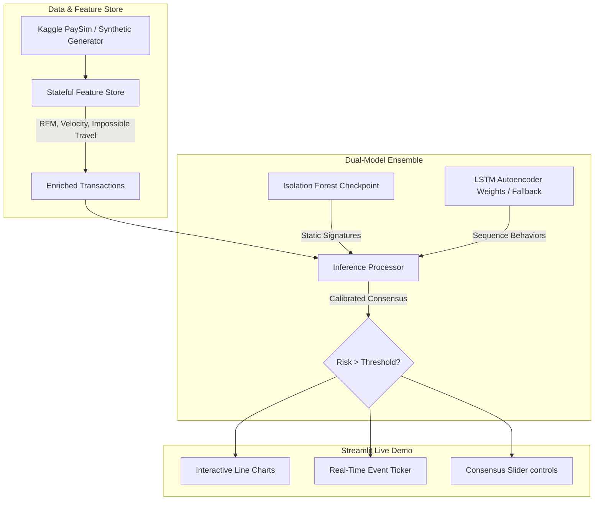

//Real-Time Unsupervised Financial Fraud Stream Guardian

This is an end-to-end, high-performance, real-time financial transaction anomaly detection platform. Engineered for highly skewed distributions where historical fraud labels are unavailable or dynamic, Sentry-AI integrates classic machine learning and deep learning sequence models within an in-process streaming architecture.

Featuring an **interactive Streamlit live dashboard**, the platform enables cybersecurity analysts to monitor transactions, dynamically blend models, adjust alert sensitivity, and simulate swipes of credit cards on the fly.

---

## 🚀 Key Features

*   **Stateful Real-Time Feature Store**: Injects rolling feature calculations on-the-fly, including sender transaction velocities, balance discrepancy equations, running monetary deviations (RFM), and geographical speed limits ("impossible travel" coordinates).
*   **Core ML Consensus Ensemble**:
    *   *Static Signature Anomaly*: **Isolation Forest** (scikit-learn) trained to isolate out-of-bounds metrics (such as extreme transaction amounts or balance exploits).
    *   *Temporal Sequence Anomaly*: **LSTM Autoencoder** (PyTorch) trained to reconstruct normal temporal sequences of user behaviors (catching sudden velocity spikes, structural multi-step transfers).
    *   *Calibrated Consensus Engine*: Blends normalized model confidence outputs into a combined transaction score using an adjustable blending ratio slider.
*   **Self-Healing Fallback**: Automatically fallbacks from PyTorch LSTM to scikit-learn MLP Sequence Autoencoders if system CUDA/DLL bindings fail, preventing runtime crashes.
*   **Premium Analytics Dashboard**: A beautiful, fully interactive visual interface built with Streamlit that plots transaction amounts, logs metrics, renders alerts, and simulates live transactions.

---

## 🛠️ Tech Stack

*   **Deep Learning Framework**: PyTorch (LSTM Autoencoder)
*   **Machine Learning Engine**: scikit-learn (Isolation Forest, StandardScaler)
*   **Dashboard Frontend**: Streamlit (Rolling Charts & Data Frames)
*   **Serialization & Data Analysis**: joblib, pandas, numpy

---

## 📐 System Architecture



---

## 📊 Stateful Feature Store Details

To catch suspicious financial behaviors, a static model is insufficient. Sentry-AI executes real-time sliding-window calculations for every transaction:
1.  **Velocity ($V_{10m}$, $V_{1h}$)**: Keeps a rolling count of a sender's transactions in the last 10 minutes and 1 hour to intercept automatic bot card sweeps.
2.  **Monetary Deviation ($RFM_{mon}$)**: Compares the current transaction amount to the sender's historically running average transaction size.
3.  **Balance Discrepancies**:
    *   $\text{Orig Discrepancy} = \text{oldbalanceOrig} - \text{newbalanceOrig} - \text{amount}$
    *   $\text{Dest Discrepancy} = \text{oldbalanceDest} + \text{amount} - \text{newbalanceDest}$
    *   In normal transactions, these values should equal zero. Mismatches strongly indicate balance-manipulation attempts.
4.  **Impossible Travel**: Calculates the Great Circle distance (Haversine formula) and elapsed time between consecutive transactions of a single cardholder. If velocity exceeds $1,000 \text{ km/h}$, a geovelocity flag is triggered.

---

## 🚀 Setup & Execution

### 1. Prerequisites & Dependencies
Ensure you have Python 3.9+ installed. Clone this repository, and install the library dependencies:
```bash
pip install -r requirements.txt
```

### 2. Dataset Setup (Optional)
This system includes a self-healing **Self-Synthesis Mode**. If you do not have the PaySim CSV downloaded, the system will automatically synthesize 50,000 realistic transactions structure-matched to PaySim (with complex injected velocity and balance errors) on the fly!

To run on the full 6.3-million-row Kaggle dataset:
1. Download the dataset from [Kaggle PaySim1](https://www.kaggle.com/datasets/ealaxi/paysim1).
2. Create a folder named `data/` in the project root directory.
3. Extract the downloaded ZIP file and rename the CSV to `PS_20174392719_1491204439457_log.csv` inside `data/`.

### 3. Start the Streamlit Application
Simply boot the application using Streamlit:
```bash
streamlit run streamlit_app.py
```

*Note: If pre-trained models are missing, the launcher will automatically execute `src/train.py` synchronously, train both models strictly on normal transaction records, calibrate detection boundaries based on target contamination limits, export performance plots, and serialize the models before launching the Streamlit app!*

---

## 🛡️ Model Architecture & Consensus Calibration

### LSTM Autoencoder (PyTorch / Fallback)
Learns normal multi-step user transaction sequences. It takes an input sequence of length $5$ with $13$ features:
```text
Encoder: LSTM(Input: 13, Hidden: 32, Layers: 2) -> Linear(Bottleneck: 16)
Decoder: RepeatVector(5) -> LSTM(Input: 16, Hidden: 32, Layers: 2) -> Linear(Output: 13)
```
Anomaly score is computed as the Mean Squared Error (MSE) reconstruction loss:
$$\text{MSE} = \frac{1}{T \cdot D} \sum_{t=1}^{T} \sum_{d=1}^{D} (x_{t,d} - \hat{x}_{t,d})^2$$

### Isolation Forest (scikit-learn)
An ensemble of Isolation Trees that recursively partitions features. Anomalies are isolated closer to the root of the trees. Scores are inverted and min-max normalized so that $1.0$ represents high-risk.

### Blended Ensemble Score
Anomalies are flagged when the blended consensus score exceeds the dynamic threshold:
$$\text{Consensus Score} = \alpha \cdot \text{Score}_{\text{IForest}} + (1 - \alpha) \cdot \text{Score}_{\text{LSTM}}$$
Adjusting $\alpha$ shifts weight between static tabular signatures and sequential temporal behaviors in real time.

Live demo link- https://real-time-fraud-detection-dxialr4iijl5smcdumnaqy.streamlit.app/
